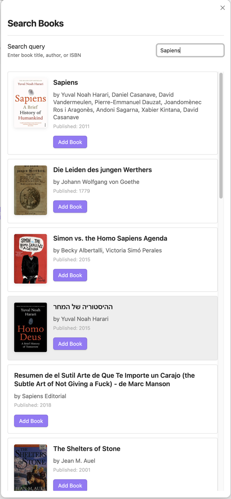

# Obsidian Reading Tracker
A reading tracker for importing books from Open Library, organizing your reading shelves, and analyzing your reading habits.

## Overview
Bookshelf helps you manage your personal library in Obsidian. Each book is stored as a Markdown note with YAML frontmatter, making it easy to integrate with your existing notes and workflows. Search and import books directly from Open Library API with automatic metadata fetching.  
Track your reading progress with page numbers and notes, which are automatically recorded in your book notes. View your library through customizable Bases views (Bookshelf, Library, Statistics) that let you organize books by reading status and analyze your reading habits over time.


## Quick start
1. **Add a book**: Click ribbon icon or `Ctrl/Cmd+P` → "Search Book"
2. **Update progress**: Open book note → Click "Progress update" button
3. **View library**: Open `base` files in `Bookshelf/Views/`

## Features

### 📚 Search and Add

- Search and import from Open Library API
- Auto-fetch metadata (title, author, publisher, ISBN, cover)

### 🎨 Manage Reading Books 


- Drag & drop books from "To Read" to "Reading" section to start tracking
- Click "Update Progress" button to record reading sessions and update progress
- Each session automatically adds to reading history


- Each book stored as Markdown note with YAML frontmatter
- Reading history recorded in note body
- All metadata and progress tracked automatically

### 📖 Library for Unread and Finished Books


- View all books not currently reading (unread and finished)
- Browse complete collection by status
- Quick access to book details and metadata

### 📊 Statistics & Analytics

- **Overall**: Total books, pages, reading days
- **Time-based**: Yearly/monthly trends with line graphs
- **Category**: Top 10 categories with bar charts

## Book Properties

Each book note uses this frontmatter:

```yaml
---
title: Book Title
author: [Author Name]
category: [Fiction, Fantasy]
publisher: Publisher Name
isbn: "1234567890"
cover: https://covers.openlibrary.org/...
total: 400                          # Total pages
status: reading                     # unread/reading/finished
read_page: 150                      # Current page
read_started: 2026-01-28 10:00:00   # Start date
read_finished: null                 # Finish date (null if not finished)
created: 2026-01-28 10:00:00        # Creation date (immutable)
updated: 2026-01-28 15:30:00        # Last update
reading_history_summary:
  - date: 2026-01-28
    startPage: 0
    endPage: 150
    pagesRead: 150
    timestamp: 2026-01-28 15:30:00
---
```

### Property Descriptions
- `title`: Book title
- `author`: List of authors
- `category`: List of categories/genres
- `publisher`: Publisher name
- `publish`: Publication date
- `isbn`: ISBN number
- `cover`: Cover image URL
- `total`: Total pages
- `status`: Reading status (`unread`, `reading`, `finished`)
- `read_page`: Current page number
- `read_started`: Date when reading started
- `read_finished`: Date when finished (null if not finished)
- `created`: Note creation timestamp (immutable)
- `updated`: Last update timestamp
- `reading_history_summary`: Array of reading sessions

## Reading History Format

Reading history is stored in the note body:

```markdown
## Reading History

### 2026-01-28
- **Pages**: 0 → 150 (150 pages)
- **Time**: 2026-01-28 15:30:00
- **Notes**: Started reading this amazing book!
```

## Support
- 🐛 [Report bugs or suggest features](https://github.com/minseon9/obsidian-bookshelf-plugin/issues)
